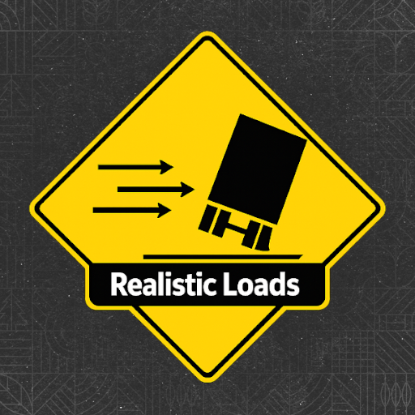

# ABANDONED
> I no longer have interest in continuing this mod as I no longer play FS25 frequently. Anyone is allowed to fork this repository and develop this mod further.

# Realistic Loads
This script mod enhances the game by incentivizing the player to utilize the already in-game mechanics for trailered items. Loose goods and crops, like wheat or hay, will fall out of trailers when moving too quickly or tipped over unless covered. The current weather, speed, and mass of the goods can change the rate at which you lose your stuff. Be careful though, if the trailer tips over at too much of an angle or the weather gets too severe then the cover may break!

> [!WARNING]
> This mod is currently in an experimental state, bugs and problems may occur. If you experience any issues please report them by making a post.
> [here](https://github.com/umbraprior/FS25_RealisticLoads/issues/new)

## [Status]
- Wind loss is working and applicable to all fill types, currently cars and rigid body trucks with tipper configurations are not working(CV, Tigre, etc.).
- Tilt loss is not implemented at this time

## [Known Bugs]
1. ~~Fix particles emit for fillUnit > 1 per vehicle (they all share the last loaded shape node)~~
2. cars/trucks that have configurations with fillUnit don't have loss or effects
3. changing systems stop emitting(may be related to #6)
4. when cleaning up particle effects when active and player/AI gets too far from the source causing them to not reappear when returning in view
5. crash with a large amount of active windloss and particles
6. user/worker needing to have active selection on trailer/implement when driving vehicle for windloss to occur

### [TODO]
- [ ] Implement tilt loss
- [ ] Implement tilt loss effects
  - initial findings suggest that it's impossible to use the grain effect seen with tipping trailers/buckets(uses a hardcoded model in the vehicle i3d)
  - most likely solution is spawning a big smoke particle on heap when loss is experienced(performance concerns)
- [ ] Config menu

#### [v1.0 Release Checklist]
- [ ] verify performance optimization is functional(distance, activity)
- [ ] verify that code is working with AI workers
- [ ] verify that working vehicles/implements experience loss
- [ ] verify liquids/slurry/milk/etc. does not experience loss
- [ ] verify compatibility with modded vehicles, trailers, and fillTypes
